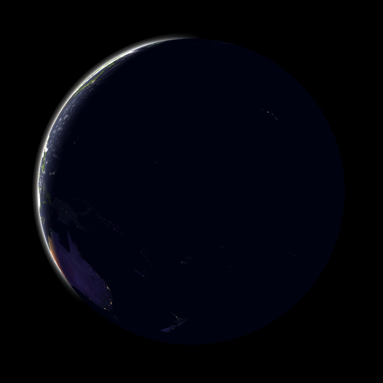

# Earth Renderer



Earth Renderer is a Go-based command-line tool and library that **aims to generate realistic views of Earth** from orbital or high-altitude perspectives using real-time lighting, cloud, and texture maps.

The `main.go` file shows how to use the renderer as a standalone program, but the core logic is reusable in other Go projects.

## Features

* Realistic Earth rendering from orbital or suborbital altitudes
* Customizable camera parameters
* Accurate sun position based on specified or current time
* Supersampling for high-quality anti-aliased output
* Efficient TIFF loading: supports striped or tiled TIFF textures without loading the whole image into memory
* Generates PNG image output
* Modular library structure for integration into other Go projects

## Installation

```bash
git clone https://github.com/echoflaresat/spacecam
cd spacecam
go build -o earth-renderer main.go
```

## Usage

```bash
./earth-renderer -h
```

Example

```bash
./earth-renderer   -lat 48.0   -lon 19.0   -alt 35786.0   -fov 25.0   -size 2048   -supersample 3   -time 2025-08-03T12:00:00Z   -out snapshot.png
```

## License

MIT License
