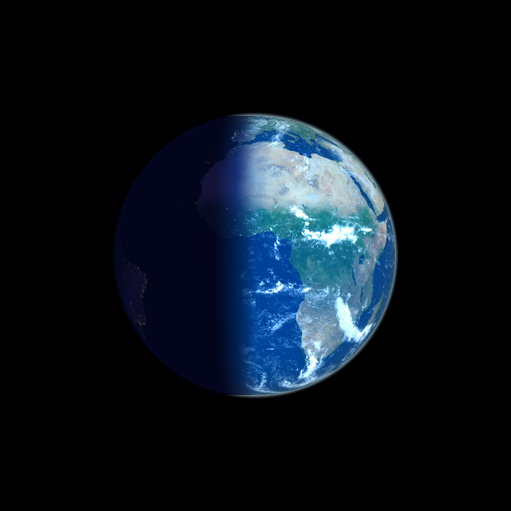

# Earth Renderer



Earth Renderer is a Go-based command-line tool and library that **aims to generate realistic views of Earth** from orbital or high-altitude perspectives using real-time lighting, cloud, and texture maps.

The `main.go` file shows how to use the renderer as a standalone program, but the core logic is reusable in other Go projects.

## Features

* Realistic Earth rendering from orbital or suborbital altitudes
* Customizable camera parameters
* Accurate sun position based on specified or current time
* Supersampling for high-quality anti-aliased output
* Efficient TIFF loading: supports striped or tiled TIFF textures without loading the whole image into memory
* Generates PNG image output
* Modular library structure for integration into other Go projects

## Installation

```bash
git clone https://github.com/echoflaresat/spacecam
cd spacecam
go build -o earth-renderer main.go
```

## Usage

```bash
./earth-renderer -h
```

Example

```bash
./earth-renderer -lat 48.0 -lon 19.0 -alt 35786.0 
```


## Texture Assets

The renderer is shipped with small textures in the `assets` directory. They originate from [NASA's Visible Earth](https://visibleearth.nasa.gov/). A fair amount of work has gone into support the rendering with full-scale "Blue Marble" texures, this is needed for good quality renders of low altitudes. You need to download and prepare the
textures as follows.

### Getting the texures

- [Blue marble](https://visibleearth.nasa.gov/collection/1484/blue-marble?page=3)
you need one without bathmetry and topology, just the plain texture.

- [Black marble](https://www.visibleearth.nasa.gov/images/144898/earth-at-night-black-marble-2016-color-maps) is available here

- [Clouds](https://visibleearth.nasa.gov/images/57747/blue-marble-clouds) are here, but they don't cover the poles and the texture doesn't properly wrap around - there is an ugly artifact where the left side meets the right.

NASA usually distributes the big texture with segments stored in different files (e.g., A1, B1, C1, D1, A2, B2, etc.). To assemble a full-resolution TIFF from NASA's cropped image segments you can use [gdal\_merge.py](https://gdal.org/) and
the supplied merge_tiles.go:

```bash

go run cmd/merge_tiles.go 4x2 assets/merged.png A1.png B1.png C1.png D1.png A2.png B2.png C2.png D2.png

gdal_merge.py -o assets/merged.tif \
  -co TILED=YES \
  -co BLOCKXSIZE=256 \
  -co BLOCKYSIZE=256 \
  -co COMPRESS=DEFLATE \
  assets/merged.png
```

Note that lazy loading is not supported for every possible TIFF format, but this configuration is known to work. These files can then be used directly in the `-day`, `-night`, or `-clouds` options. 

## License

MIT License
