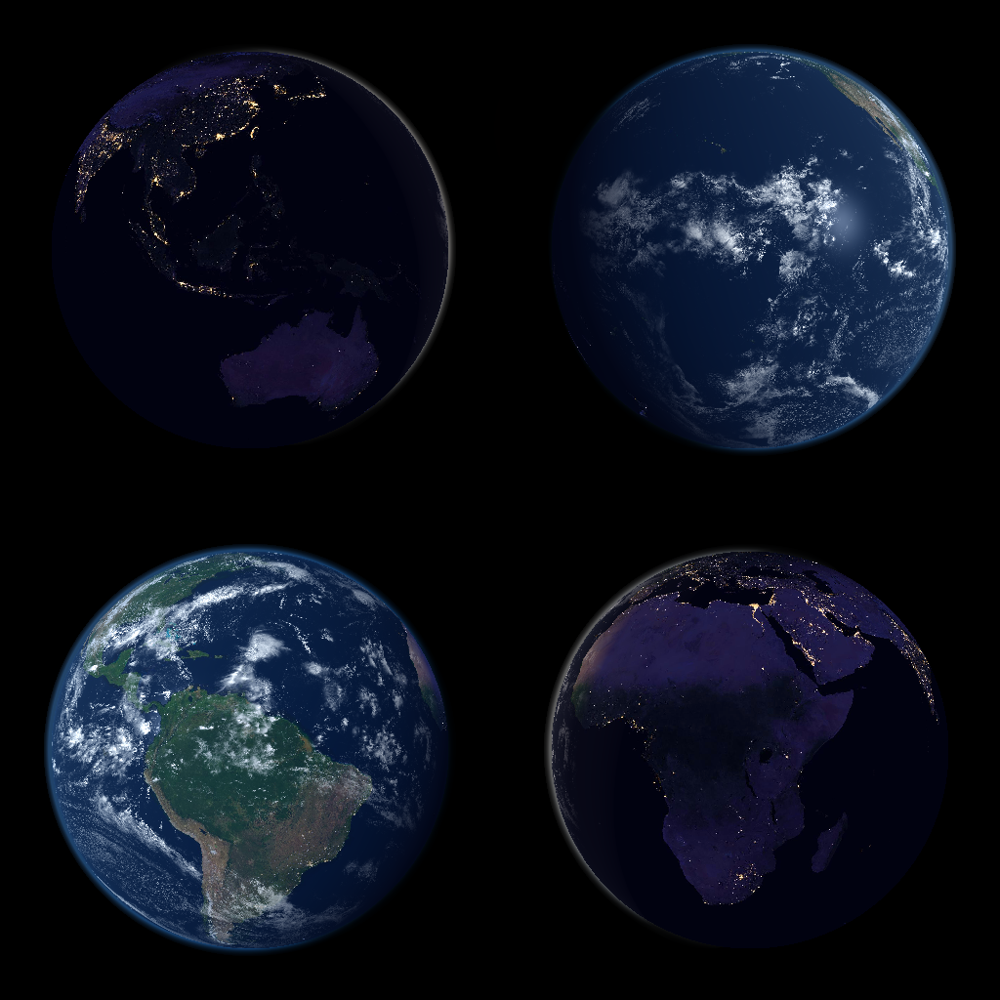

# Earth Renderer



Earth Renderer is a Go-based library and command-line tool that generates photorealistic views of Earth from a satellite, high-altitude, or LEO (Low Earth Orbit) perspective using real-time lighting, cloud, and texture maps. This renderer is suitable for producing visuals for satellite simulations, mission planning tools, and educational applications.

The `main.go` file provides an example usage of the library as a standalone executable, but the core rendering logic is fully reusable in other Go programs.

## Features

* Realistic Earth rendering from orbital or suborbital altitudes
* Customizable camera parameters (lat/lon/alt, field of view, tilt)
* Supports day, night, and cloud texture blending
* Accurate sun position based on specified or current time
* Supersampling for high-quality anti-aliased output
* Efficient TIFF loading: supports striped or tiled TIFF textures without loading the whole image into memory
* Generates PNG image output
* Modular library structure for integration into other Go projects

## Texture Assets

The textures in the `assets` directory originate from [NASA's Visible Earth](https://visibleearth.nasa.gov/). A fair amount of work has gone into processing large-scale "Blue Marble" datasets, which can be up to 80,000 x 40,000 pixels in resolution.

NASA often distributes these textures in multiple cropped segments (e.g., A1, B1, C1, D1, A2, B2, etc.). These segments can be reassembled into a single large TIFF file using image tools. The Earth Renderer can efficiently use such TIFF files—even very large ones—thanks to its support for lazy loading of striped or tiled formats.

This allows rendering high-resolution Earth views without requiring excessive memory.

To assemble a full-resolution TIFF from NASA's cropped image segments (e.g., A1, B1, A2, etc.), you can use tools like [ImageMagick](https://imagemagick.org/) or [gdal\_merge.py](https://gdal.org/):

```bash
# Using ImageMagick (ensure all tiles are the same size):
magick montage A1.png B1.png C1.png D1.png \
               A2.png B2.png C2.jpg D2.png \
               -tile 4x2 -geometry +0+0 full_earth.png

# Then convert to TIFF:
magick full_earth.png -define tiff:tile-geometry=256x256 -compress Zip full_earth_tiled.tif
```

For better performance in Earth Renderer, you can convert the resulting image to a tiled or striped TIFF using:

```bash
gdal_translate \
  -of GTiff \
  -co TILED=YES \
  -co BLOCKXSIZE=256 \
  -co BLOCKYSIZE=256 \
  -co COMPRESS=DEFLATE \
  cloud.2001210.png  cloud.2001210.tif
```

This TIFF can then be used directly in the `-day`, `-night`, or `-clouds` options.

## Installation

```bash
git clone https://github.com/echoflaresat/spacecam
cd spacecam
# Ensure dependencies are available, then build:
go build -o earth-renderer main.go
```

## Usage

```bash
./earth-renderer [options]
```

### Camera Options

* `-lat`: Camera latitude in degrees (default `0.0`)
* `-lon`: Camera longitude in degrees (default `19.0`)
* `-alt`: Camera altitude in kilometers (default `10878.0`)
* `-fov`: Field of view in degrees (default `60.0`)
* `-tilt`: Camera tilt angle in degrees (default `0.0`)

### Rendering Options

* `-size`: Output image size (square, width x height in pixels, default `4096`)
* `-supersample`: Supersampling factor for anti-aliasing (default `2`)
* `-time`: Time in RFC3339 format, e.g., `2025-08-02T15:04:05Z`; defaults to current time

### Asset Paths

* `-day`: Path to day-side Earth texture (default `assets/world.200408.3x21600x10800.jpg`)
* `-night`: Path to night-side texture (default `assets/earth_night_scaled.jpg`)
* `-clouds`: Path to cloud overlay (default `assets/earth_clouds_scaled.jpg`)

### Output

* `-out`: Output PNG file path (default `earth_view.png`)

### Misc

* `-h`: Show help message

## Example

Render an image from geostationary altitude above central Europe:

```bash
./earth-renderer \
  -lat 48.0 \
  -lon 19.0 \
  -alt 35786.0 \
  -fov 45.0 \
  -tilt 0 \
  -size 2048 \
  -supersample 3 \
  -time 2025-08-03T12:00:00Z \
  -out snapshot.png
```

## Output

Produces a PNG image (`snapshot.png` by default) showing the rendered view from the configured camera. Output can vary from high-resolution photorealism to pixel-art-like aesthetics, depending on the output size and supersampling settings.

## Library Usage

To use Earth Renderer in your own Go project, import the necessary packages:

```go
import (
    "github.com/echoflaresat/spacecam/render"
    "github.com/echoflaresat/spacecam/earth"
    "github.com/echoflaresat/spacecam/colors"
)
```

Then construct a camera, compute the sun direction, and call `render.RenderScene` to generate the image.

## License

MIT License

---

This project is part of the [EchoflareSat](https://github.com/echoflaresat) initiative.
